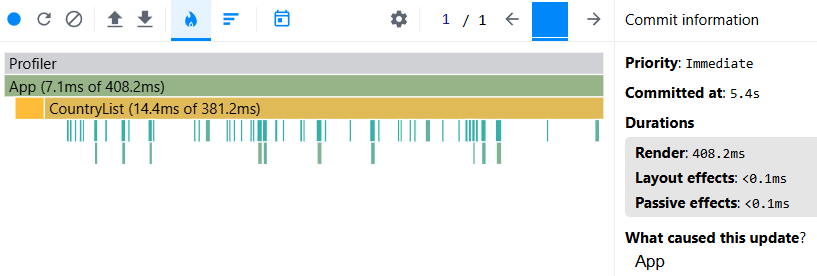
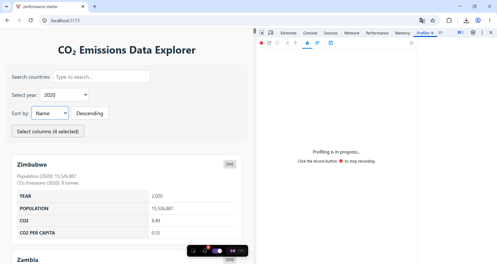
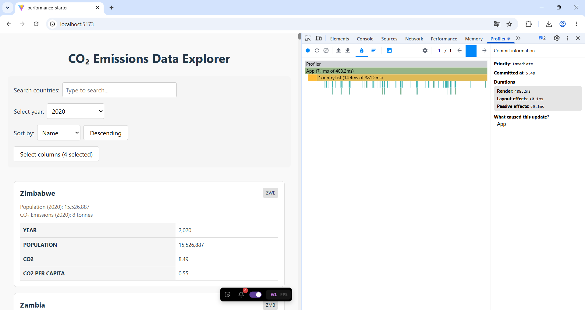
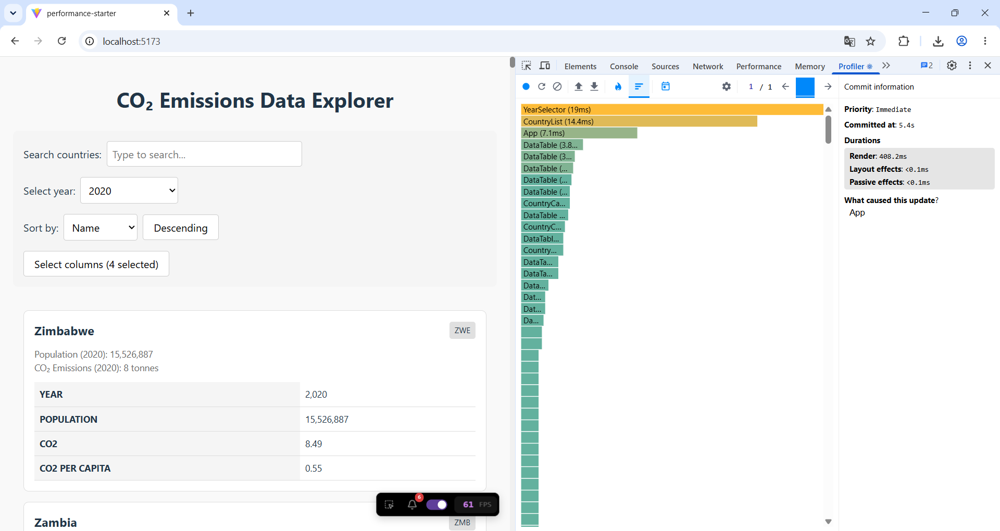

# Performance Optimization Report

## Baseline Measurements

### Interaction A: Sort countries

- **Commit duration**: 0.4 s
- **Render duration**: 408.2 ms
- **Screenshot**: 

  
What I do:

  1. `npm run dev`
  1. Open http://localhost:5173/
  1. `Fn` + `F12`
  1. On Dev Tools open `Profiler` tab
  1. Click to blue circle with title `Start profiling`
    
  1. I changed `Population` to `Name` on select `Sort by`
  1. I wait all renders
  1. Click to red circle with title `Stop profiling`
    
      - Flamegraph chart:
          
      - Ranked chart:
          
      - JSON profile: [open](./docs/Performance-Optimization-Report/Baseline-Measurements/Interaction-A-Sort-countries/profiling-data.15.06.2026.00-56-40.json)

### Interaction B: Search countries

- **Commit duration**: \_\_\_ s
- **Render duration**: \_\_\_ ms
- **Screenshot**: 

### Interaction C: Change year

- **Commit duration**: \_\_\_ s
- **Render duration**: \_\_\_ ms
- **Screenshot**: 

### Interaction D: Toggle column

- **Commit duration**: \_\_\_ s
- **Render duration**: \_\_\_ ms
- **Screenshot**: 
