# Performance Optimization Report

## Baseline Measurements

### Interaction A: Sort countries

- **Commit duration**: [Not Available](https://discord.com/channels/794806036506607647/1333748258098380820/1515111545905090610)
    > [13.06.2026, 00:52] SpaNb4 (@spanb4) (moderator/trainer/mentor/rs-activist)
    >
    > In short, let's just focus on the Render Duration report for now. For the next iteration, I'll adjust it to something like: Number of commits + duration per commit
- **Render duration**: 408.2 ms
- **Screenshot**: 

  
More

  1. `npm run dev`
  1. Open http://localhost:5173/
  1. `Fn` + `F12`
  1. On Dev Tools open `Profiler` tab
  1. Click to blue circle with title `Start profiling`
    
  1. I changed `Population` to `Name` on select `Sort by`
  1. I wait all renders
  1. Click to red circle with title `Stop profiling`
    
      - Flamegraph chart:
          
      - Ranked chart:
          
      - JSON profile: [open](./docs/Performance-Optimization-Report/Baseline-Measurements/Interaction-A-Sort-countries/profiling-data.15.06.2026.00-56-40.json)

### Interaction B: Search countries

- **Commit duration**: [Not Available](https://discord.com/channels/794806036506607647/1333748258098380820/1515111545905090610)
    > [13.06.2026, 00:52] SpaNb4 (@spanb4) (moderator/trainer/mentor/rs-activist)
    >
    > In short, let's just focus on the Render Duration report for now. For the next iteration, I'll adjust it to something like: Number of commits + duration per commit
- **Render duration**: 118.9 ms
- **Screenshot**: 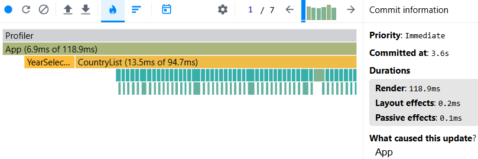

  
More

  1. Reload page
  1. I click to blue circle with title `Start profiling` on F12 DevTools on tab `Profiler`
    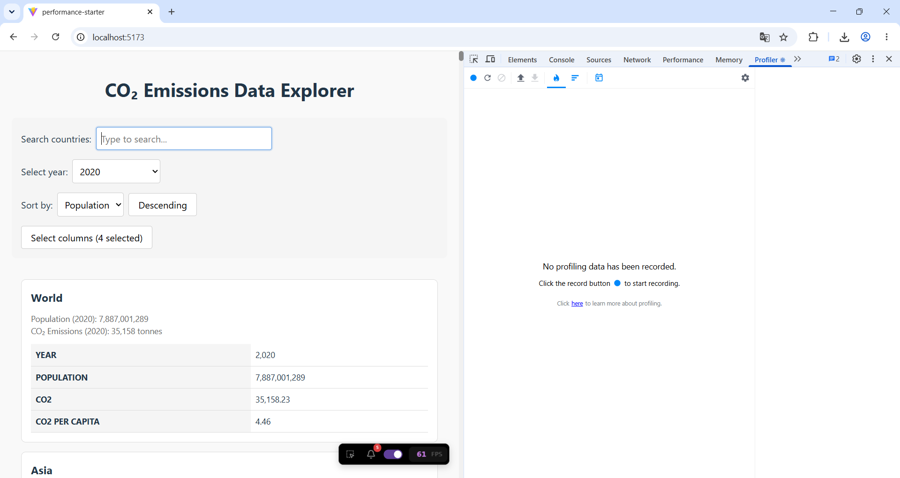
  1. I changed `Search countries` input from `<empty>` to `Belarus`
  1. I wait all renders
  1. I click to red circle with title `Stop profiling` on F12 DevTools on tab `Profiler`
    
      - Flamegraph chart:
          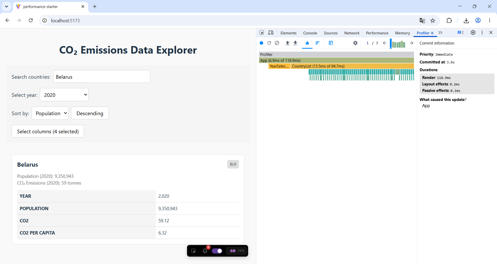
      - Ranked chart:
          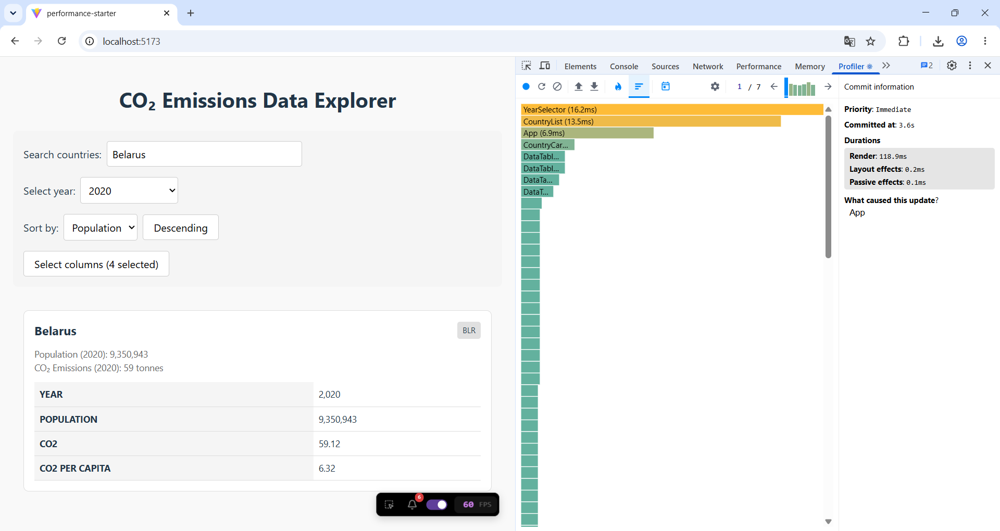
      - JSON profile: [open](./docs/Performance-Optimization-Report/Baseline-Measurements/Interaction-B-Search-countries/profiling-data.15.06.2026.01-11-10.json)

### Interaction C: Change year

- **Commit duration**: [Not Available](https://discord.com/channels/794806036506607647/1333748258098380820/1515111545905090610)
    > [13.06.2026, 00:52] SpaNb4 (@spanb4) (moderator/trainer/mentor/rs-activist)
    >
    > In short, let's just focus on the Render Duration report for now. For the next iteration, I'll adjust it to something like: Number of commits + duration per commit
- **Render duration**: 404.2 ms
- **Screenshot**: 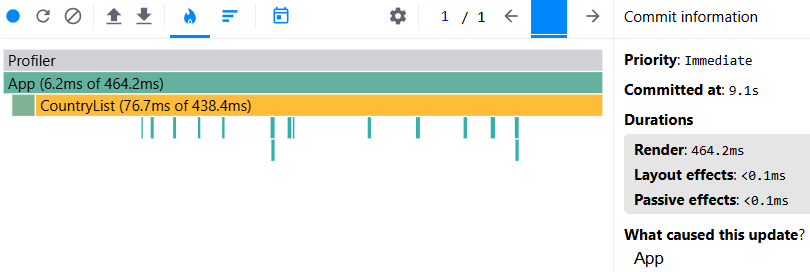

  
More

  1. Reload page
  1. I click to blue circle with title `Start profiling` on F12 DevTools on tab `Profiler`
    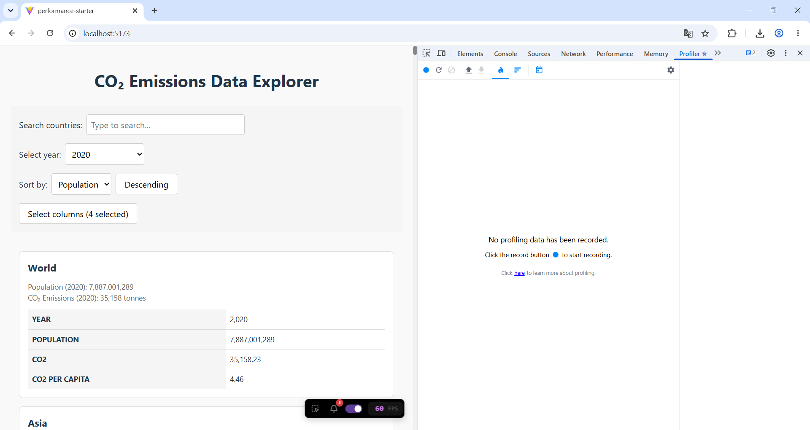
  1. I changed `Select year` input from `2020` to `2024`
  1. I wait all renders
  1. I click to red circle with title `Stop profiling` on F12 DevTools on tab `Profiler`
      - 2020 replaced by 2024. All renderings have been completed.
          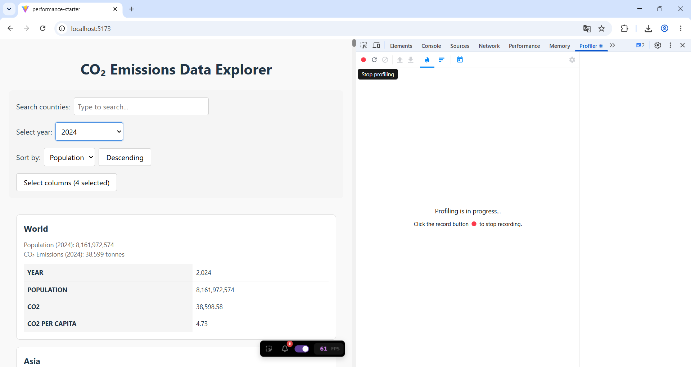
      - Flamegraph chart:
          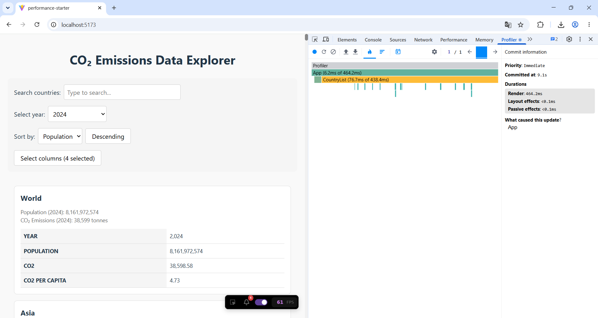
      - Ranked chart:
          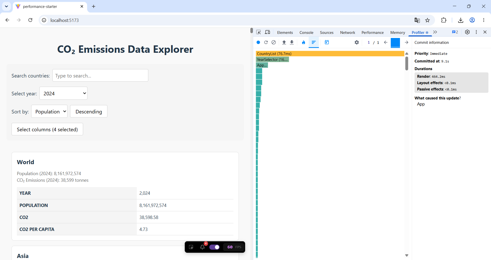
      - JSON profile: [open](./docs/Performance-Optimization-Report/Baseline-Measurements/Interaction-C-Change-year/profiling-data.15.06.2026.01-24-59.json)

### Interaction D: Toggle column

- **Commit duration**: [Not Available](https://discord.com/channels/794806036506607647/1333748258098380820/1515111545905090610)
    > [13.06.2026, 00:52] SpaNb4 (@spanb4) (moderator/trainer/mentor/rs-activist)
    >
    > In short, let's just focus on the Render Duration report for now. For the next iteration, I'll adjust it to something like: Number of commits + duration per commit
- **Render duration**: 471 ms
- **Screenshot**: 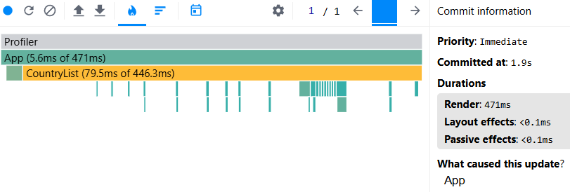

  
More

  1. Reload page
  1. I click to `Select columns (4 selected)` button
    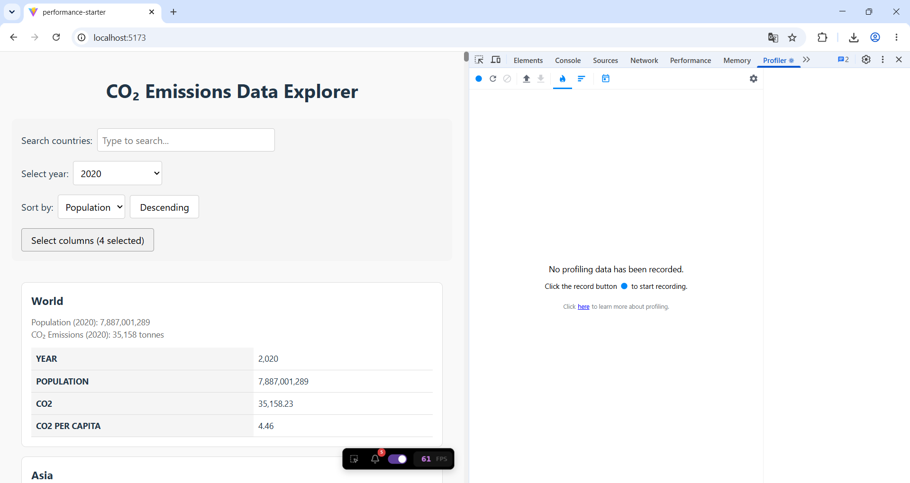
  1. I wait all renderes
  1. I click to blue circle with title `Start profiling` on F12 DevTools on tab `Profiler`
    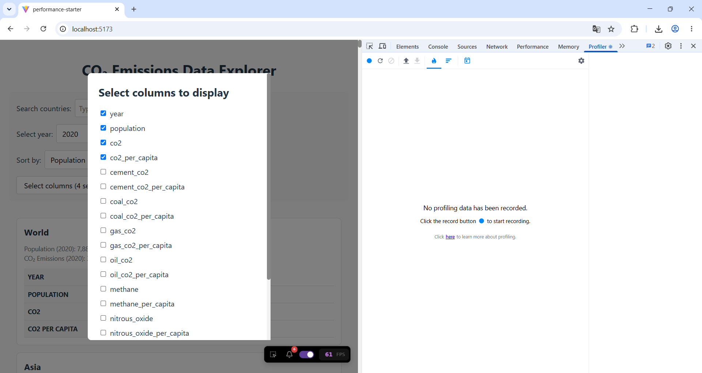
  1. I unselect `co2_per_capita
  1. I wait all renders
  1. I click to red circle with title `Stop profiling` on F12 DevTools on tab `Profiler`
      - All renderings have been completed - and click red circle
          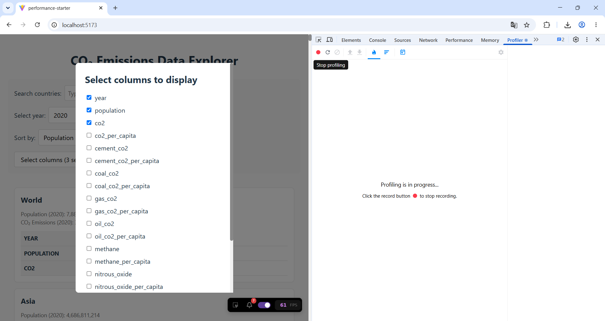
      - Flamegraph chart:
          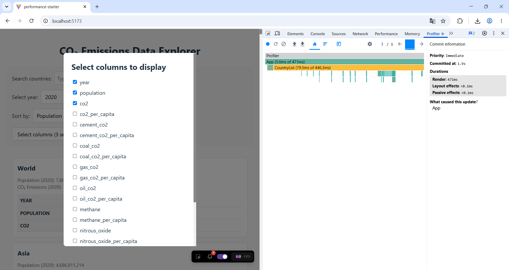
      - Ranked chart:
          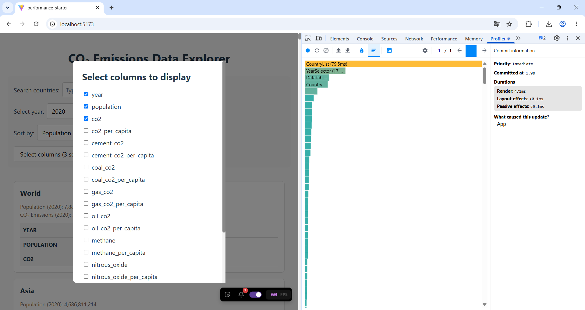
      - JSON profile: [open](./docs/Performance-Optimization-Report/Baseline-Measurements/Interaction-D-Toggle-column/profiling-data.15.06.2026.01-48-34.json)

## Optimized Measurements

### Interaction A: Sort countries
- **Commit duration**: [Not Available](https://discord.com/channels/794806036506607647/1333748258098380820/1515111545905090610)
    > [13.06.2026, 00:52] SpaNb4 (@spanb4) (moderator/trainer/mentor/rs-activist)
    >
    > In short, let's just focus on the Render Duration report for now. For the next iteration, I'll adjust it to something like: Number of commits + duration per commit
- **Render duration**: 16.5 ms
- **Screenshot**: 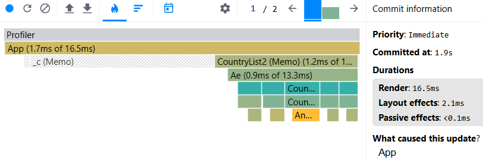

  
More

  1. Reload page
  1. Click to blue circle with title `Start profiling`
  1. I changed `Population` to `Name` on select `Sort by`
  1. I wait all renders
  1. Click to red circle with title `Stop profiling`

      - Flamegraph chart:
          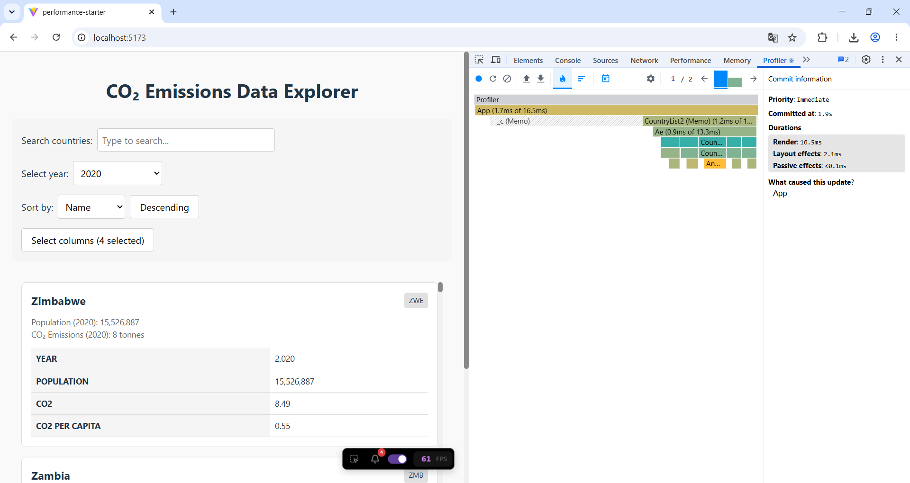
      - Ranked chart:
          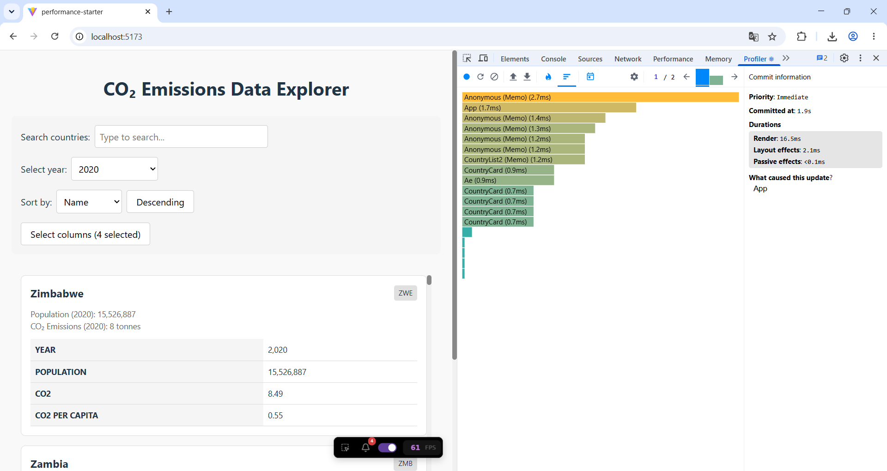
      - JSON profile: [open](./docs/Performance-Optimization-Report/Optimized-Measurements/Interaction-A-Sort-countries/profiling-data.15.06.2026.22-59-46.json)

### Interaction B: Search countries

- **Commit duration**: [Not Available](https://discord.com/channels/794806036506607647/1333748258098380820/1515111545905090610)
    > [13.06.2026, 00:52] SpaNb4 (@spanb4) (moderator/trainer/mentor/rs-activist)
    >
    > In short, let's just focus on the Render Duration report for now. For the next iteration, I'll adjust it to something like: Number of commits + duration per commit
- **Render duration**: 20.9 ms
- **Screenshot**: 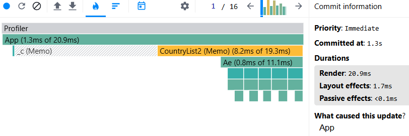

  
More

  1. Reload page
  1. I click to blue circle with title `Start profiling` on F12 DevTools on tab `Profiler`
  1. I changed `Search countries` input from `<empty>` to `Belarus`
  1. I wait all renders
  1. I click to red circle with title `Stop profiling` on F12 DevTools on tab `Profiler`

      - Flamegraph chart:
          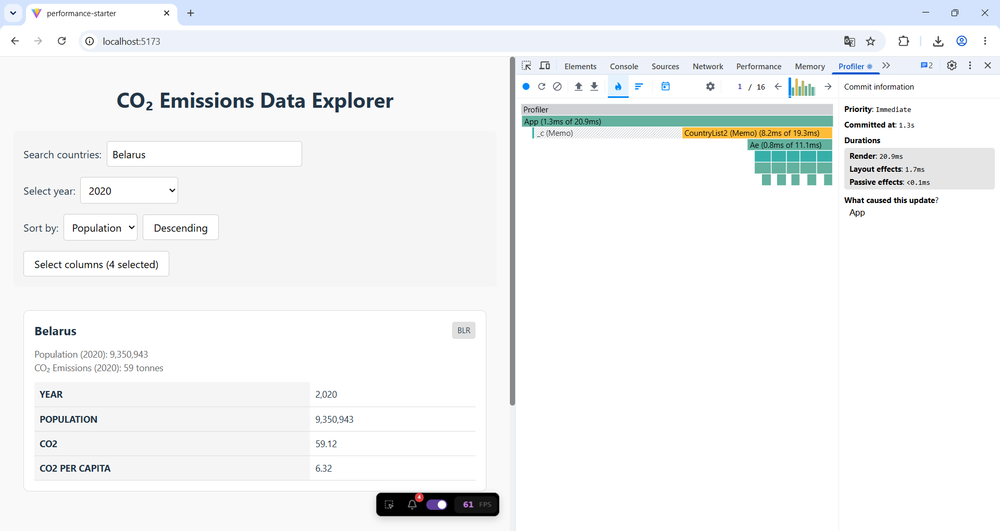
      - Ranked chart:
          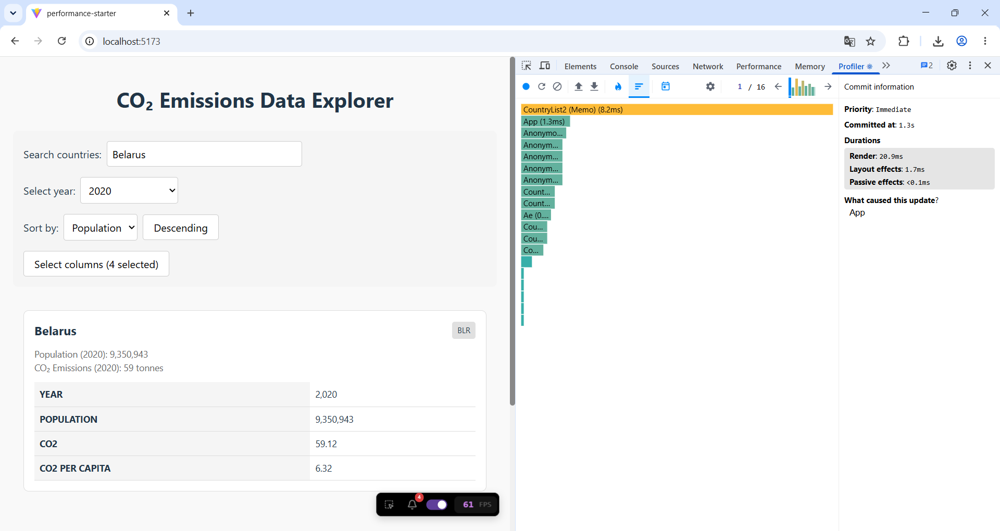
      - JSON profile: [open](./docs/Performance-Optimization-Report/Optimized-Measurements/Interaction-B-Search-countries/profiling-data.15.06.2026.23-02-11.json)

### Interaction C: Change year

- **Commit duration**: [Not Available](https://discord.com/channels/794806036506607647/1333748258098380820/1515111545905090610)
    > [13.06.2026, 00:52] SpaNb4 (@spanb4) (moderator/trainer/mentor/rs-activist)
    >
    > In short, let's just focus on the Render Duration report for now. For the next iteration, I'll adjust it to something like: Number of commits + duration per commit
- **Render duration**: 89.7 ms
- **Screenshot**: 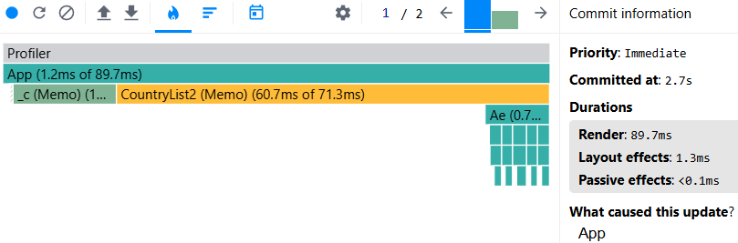

  
More

  1. Reload page
  1. I click to blue circle with title `Start profiling` on F12 DevTools on tab `Profiler`
  1. I changed `Select year` input from `2020` to `2024`
  1. I wait all renders
  1. I click to red circle with title `Stop profiling` on F12 DevTools on tab `Profiler`

      - Flamegraph chart:
          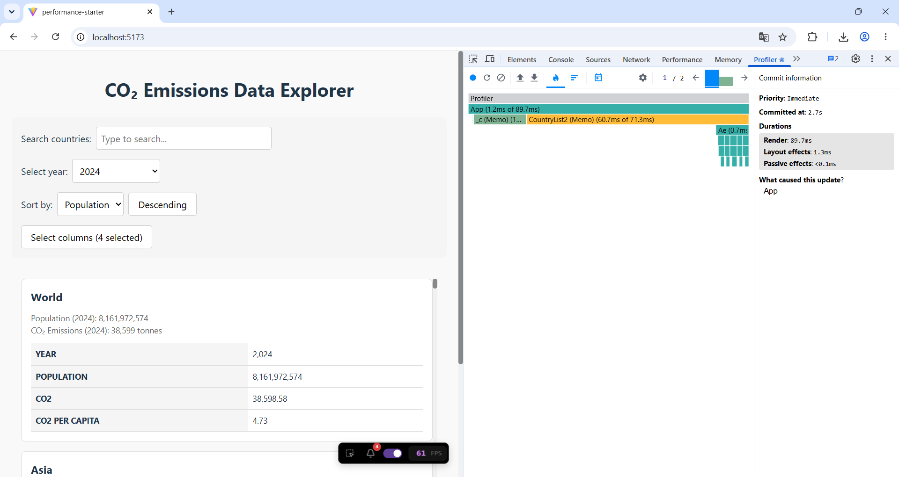
      - Ranked chart:
          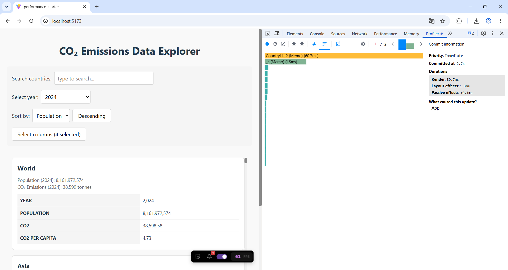
      - JSON profile: [open](./docs/Performance-Optimization-Report/Optimized-Measurements/Interaction-C-Change-year/profiling-data.15.06.2026.23-04-40.json)

### Interaction D: Toggle column

- **Commit duration**: [Not Available](https://discord.com/channels/794806036506607647/1333748258098380820/1515111545905090610)
    > [13.06.2026, 00:52] SpaNb4 (@spanb4) (moderator/trainer/mentor/rs-activist)
    >
    > In short, let's just focus on the Render Duration report for now. For the next iteration, I'll adjust it to something like: Number of commits + duration per commit
- **Render duration**: 16.1 ms
- **Screenshot**: 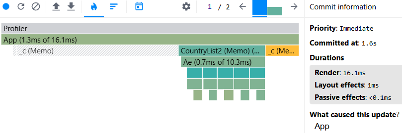

  
More

  1. Reload page
  1. I click to `Select columns (4 selected)` button
  1. I wait all renderes
  1. I click to blue circle with title `Start profiling` on F12 DevTools on tab `Profiler`
  1. I unselect `co2_per_capita
  1. I wait all renders
  1. I click to red circle with title `Stop profiling` on F12 DevTools on tab `Profiler`
      - Flamegraph chart:
          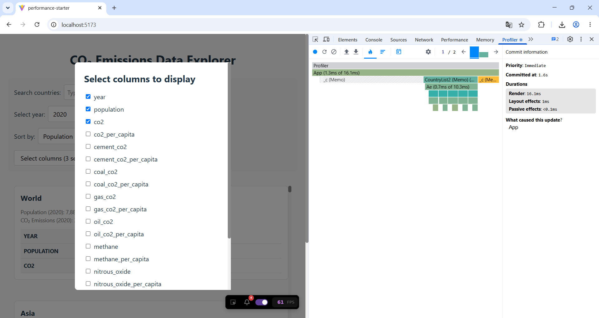
      - Ranked chart:
          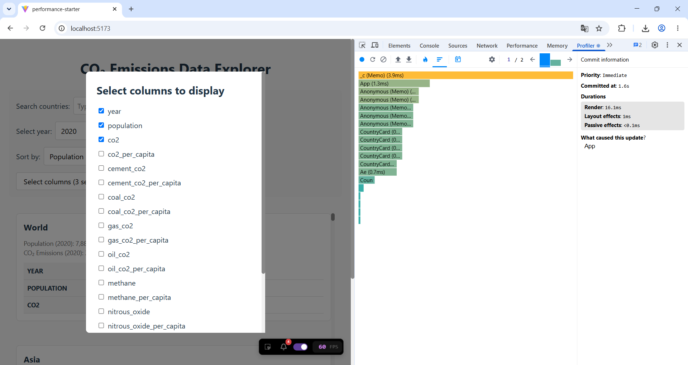
      - JSON profile: [open](./docs/Performance-Optimization-Report/Optimized-Measurements/Interaction-D-Toggle-column/profiling-data.15.06.2026.23-07-11.json)

## Summary of Improvements

| Interaction      | Baseline (ms) | Optimized (ms) | Improvement |
| ---------------- | ------------- | -------------- | ----------- |
| Sort countries   |         408.2 |           16.5 |      95.96% |
| Search countries |         118.9 |           20.9 |      82.42% |
| Change year      |         404.2 |           89.7 |      77.81% |
| Toggle column    |         471.0 |           16.1 |      96.58% |
| **Average**      |         350.7 |           35.8 |      89.79% |
